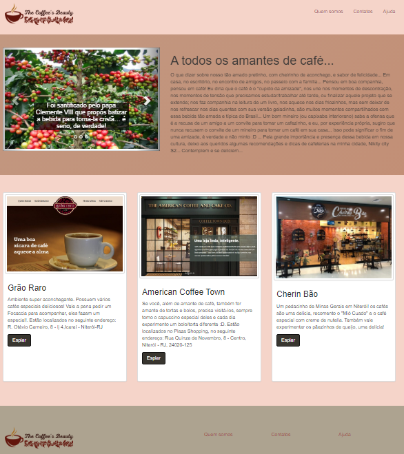

# My_coffee_project_php
<h1> Project Description<h1>
<h3> This is a web page created to practice and consolidate knowledge of dynamic pages development using php. It is a web page covering curiosities and beauties of coffee.<h3>
<h3> html, css, Bootstrap and Javascript were used to create and stylize the page and php was used to make the page dynamic.<h3>
 <h3> A previous image of the web page progress is presented below<h3>

  
